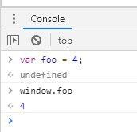

# LoScore

## Objectives - 達成目標

この単元を通して習得すること：

- 🧠 アキュムレータの問題を解けるようになる
- ➰ インデックスを使って配列の各要素にループでアクセスする
- ✅ Jasmine のテストをパスするためにコードを書く
- ⌨️ 引数として関数を受け取る関数を書く
- ➡️ 関数に対してコールバックを渡す
- 👉 ハッシュマップに値を追加する
- 👈 ハッシュマップから値を取り出す
- 👍 オブジェクトのプロパティにアクセスするためにブラケット (角括弧) 表記法を使う

## Tutorial - チュートリアル

これは、自分で考え理解しながら進めていく、という経験をしてもらうのも、カリキュラムの一部です。

技術の進歩は非常に速いので、特定の技術を知っているだけでは不十分です。
技術系の仕事に就く場合👨🏾‍💻👩🏻‍💻、成功するかどうかは、常に新しいことを学び続け、自分で考えて使い方や解法を見つけ出せるかどうかにかかっています。カリキュラムを通して、次のようなエンジニアとしての直感を磨いてもらいたいと思っています。

1. どのようなキーワードでGoogle検索したらよいのか。
1. ネットで何を探したらよいか。
1. 良い参考資料と悪い参考資料の見分け方。
1. エラーメッセージの読み方。
1. コードからどのような手がかりを得ることができるか。

[Underscore.js](http://underscorejs.org/) と [Lodash](https://lodash.com/) は JavaScript のライブラリ 📚 です。ライブラリとはあなたのコードを単純化するためにメソッドを提供してくれるものです。ここではそれを活用するのではなく、それらをあなたの手で最初から作ってみるという練習をやってもらいます！

この 2 つのライブラリのメソッドは `_` という名前の変数に格納されます。

> 🔧 **注記：** 変数にアンダースコアの名前をつけるのは、[一般的に避けるべきです](https://javascript.info/ninja-code)。ただし、Underscore.js は特殊な環境下で動かすため、そのスタイルをそのまま採用しています。

この宿題では、自分で作る `_` というオブジェクトに Underscore や Lodash ライブラリにあるメソッドを自分の手で実装することにより、JavaScript のスキルを実現してもらいます。

もしこれらのメソッドをどう書けばよいか理解できたら、どのように使えるかも理解できるでしょう！

### Window

変数 `_` は `window` というオブジェクトに存在します。プリコースのこれまでの課題でも使われているのを見たことがあるでしょう。`window` って何だろう？と思うかもしれません。

グローバル変数は、一般的な変数とは異なります。グローバル変数は1つしかありません。それが、`window` という変数です。

この変数にはオブジェクトが入っています。`var` を使って変数を定義すると、`window` オブジェクトの中にその変数の名前のプロパティを作っていることになります。例えば、`var foo = 4;` は、関数の外で変数を定義すると、`window` オブジェクトに値4を持つ `.foo` という*プロパティ*を作成します。



例えば、JavaScriptがコードを解釈する際、変数らしきものがあった場合、まずローカルスコープにある変数のチェックを行います。もしローカルスコープ上に一致する変数定義がない場合、グローバルスコープ上、つまり `window` オブジェクトのプロパティとして存在するかどうかをチェックします。`window` オブジェクトにも存在しない場合、`window` オブジェクトにその変数名のプロパティを作成することになります。

その変数名をプロパティとして使用した場合、そのプロパティに対応する値を返します。プロパティが存在しない場合、JavaScriptは `undefined` を返すか、`use strict;` を使用している場合にはエラーを返します。

変数を定義していなかったことにより `undefined` が返ってきてしまうのは意図した結果ではないため、常に `use strict;` を用いるべきです。`loscore.js` ファイルの先頭にも記述されています。

ES6ではこの挙動を制御するために `let` や `const` が追加されました。この挙動は `let` や `const` を使って変数定義したときには起こらないので注意してください。また、重要なことは `window` オブジェクトというグローバルオブジェクトが存在するということです。

`(()=>{...})();` もグローバル変数をコントロールするために使えます。以下のように window オブジェクトに特別なグローバル変数を割り当てることもできます。

`window.someObject = {};`

`loscore.js` のファイルでは、以下のようにして `window` オブジェクトに `_` という名前のオブジェクトを追加します。

`window._ = {};`

`testrunner.html` ファイルには、2つのJavaScriptファイルがこのようにリンクされています。


ブラウザで `testrunner.html` ファイルを開くと、リンクされているJavaScriptファイルに書かれたコードも含めて、ファイル内のすべてのコードが実行されます。

あなたの書いたコードとテストのためのコード、2つのファイルがありますが、2つのファイルともブラウザで実行され、どちらもグローバル変数 `window` オブジェクトにアクセスすることができます。

テストでは、グローバル変数である `_` オブジェクトを使ってあなたの書いたコードにアクセスし、関数を実行してテストを実施しています。

定義したすべての関数を `(()=>{...})();` で囲んでしまうと、本来ならばそのスコープ内しかアクセスできないはずですが(つまりテストがその関数にアクセスできなくなってしまう)、巨大な `window` グローバルオブジェクトに追加することで、テストが関数にアクセスできるようになります。

今すぐに `window` オブジェクトを使う必要はありませんが、`window` オブジェクトの存在を覚えておいてください。

### Reading Tests

テストファイルの読み方を学ぶことも重要です。また、`spec/_loscore.js` にあるテストを読むことで、どのようなコードを書くべきか理解するのに非常に役立ちます。これらのテストはJasmineというものを使って書かれています。Jasmineは、JavaScriptのテストフレームワークです。

ライブラリとフレームワークはどちらも同じ目的のために使われています。デベロッパーは似たような作業を何度もくり返しますし、同じようなことを行う関数を複数のプロジェクトでくり返し書くこともあります。ライブラリやフレームワークはあらかじめ書かれたコードを再利用することで、ある機能や枠組みを実現することができます。

例えば、テストを書く際にライブラリを使用する場合としない場合の比較を行ってみましょう。下記のように、ゼロからすべてのテストを書くこともできます。

```js

const myFunction = (num) => {
    return num + 2;
};

const actualOutput = myFunction(5);

if (actualOutput === 7) {
    console.log("This test has passed!");
    return true;
}

```
次のように、function, input, expectedOutput を引数に取って、結果が一致するかどうかをテストする関数を書くこともできます。

```js

const myFunction = (num) => {
  return num + 2;
};

const testIfThatOtherFunctionReturnsTheCorrectThing = (function, input, expectedOutput) => {
  const actualOutput = function(input);
  if (actualOutput === expectedOutput) {
    console.log("This test has passed!");
    return true
  } else {
    return false;
  }
};

testIfThatOtherFunctionReturnsTheCorrectThing(myFunction, 5, 7);

```

Jasmineのテストはこれに似ていて、同じコンセプトで作動します。実際値が期待値と等しいかどうかをチェックすることにより、テストしているコードが確実に作動することを保証します。

Jasmineにはテストを行うためのメソッドがいくつか定義されています。`testrunner.html` ファイルには、次のようにあらかじめ書かれたJasmineのコードが含まれています。

```HTML
<link rel="stylesheet" href="./lib/jasmine.css">

  <script src="./lib/jasmine.js"></script>
  <script src="./lib/jasmine-html.js"></script>
  <script src="./lib/boot.js"></script>

  <script src="./lib/jasmine.js"></script>
  <script src="./lib/testUtils.js"></script>
```
HTMLファイルにリンクされたそれぞれのファイルには、長くて複雑なJasmineのコードが書かれています。このようにして、それぞれのファイルで定義されているメソッドにアクセスすることができるのです。

このコードブロックのメソッドについて見ていきましょう。

```js
  describe('Basics', () => {
    describe('identity', () => {
      it('should return the value passed to it', () => {
        const obj = {};
        const arr = [];
        expect(_.identity(1)).toEqual(1);
        expect(_.identity('string')).toEqual('string');
        expect(_.identity(true)).toBeTruthy();
        expect(_.identity(obj)).toEqual(obj);
        expect(_.identity(arr)).toEqual(arr);
      });
    });
  });
```

#### Describe

例として、`lib/jasmine.js` ファイルにある `describe` メソッドのコードを見てみましょう。このファイルには5000行のコードが書かれています。

```js
    this.describe = function(description, specDefinitions) {
      ensureIsFunction(specDefinitions, 'describe');
      var suite = suiteFactory(description);
      if (specDefinitions.length > 0) {
        throw new Error('describe does not expect any arguments');
      }
      if (currentDeclarationSuite.markedPending) {
        suite.pend();
      }
      addSpecsToSuite(suite, specDefinitions);
      return suite;
    };
```

これは、あらかじめ書かれた複雑なコードであり、コードを理解しようとしたり、何が書かれているのか心配しなくて構いません。

もう一度言いますが、今はこのコードについて心配したり、理解しようとする必要はありません。コードを見たり、何かをする必要もありません。誰かが難しい設定作業をしてくれたおかげで、私たちはこのフレームワークを使うことができるのです。

では、`describe` は実際に何をするのでしょうか？

Jasmineが提供する `descfribe` は、関連するテストをグループ化するための関数です。ファイルには、少なくとも1つの `describe` でグループ化されたテストがあります。

第1引数に、文字列を受け取ります。これはテストのグループの名前です。

さらに、テストをラップする関数を第2引数として受け取ります。

これは、どのテストが実行されているかわかりやすくするように、コードを整理するための仕組みです。

```js
  describe('Basics', () => {
// 'describe' はJasmineによって提供されている関数です。
// 第1引数に文字列を取ります。これはグルーピングされたテストの名前になります。(ここは'Basics'セクションという名前になる)
// 第2引数には、このブロックのテストをラップする関数を取ります。
    describe('identity', () => {
        // これはBasics describe blockの中にあるdescribe blockで、テストをさらに分けるためのものです。
```

#### it

`it` はJasmineが提供するもう一つの関数です。`it` も文字列と関数を引数として受け取ります。

文字列はテストのタイトルです。

関数はテストの内容、つまり’spec’です。

specには、コードをテストするためのテストコードを1つ以上含みます。

```js
it('should return the value passed to it', () => {
// 'it' はJasmineフレームワークが提供する関数です。
// 第1引数は、このテストのタイトルとなる文字列です。
// 第2引数は、このブロックのテストをラップする関数です。
```

#### expect

Jasmine の `expect` は、true か false かを判定するアサーションという仕組みです。

```js
expect(_.identity(1)).toEqual(1);
```

これは、次のコードと同じような動きをします。

```js
if (_.identity(1) === 1) {
  return true;
}
```

すべての結果が true となる spec は、テストをパスします。

1 つ以上の結果が false となる spec は、テスト失敗です。

これらのテストに使用されるメソッドの詳細は、[ここ](https://jasmine.github.io/tutorials/your_first_suite)から調べることができます。

## Basic Requirements - 基礎レベル

🔧 **注：** これは長い課題であり、多くの生徒が苦戦しています。これらの関数を書くのに苦労して長い時間がかかる場合は、コードを書く敏捷性が低い証拠です。コーディングを上達する方法の 1 つは、練習することです。そして、この課題がその練習なのです！ さて、**インターネットから解答をコピーすることは、どの課題においても厳禁としています。そして、特にこの課題では絶対にして欲しくないです。** この課題を完了させるためにネット上で解答を探しているようでしたら、まず我々スタッフに助けを求めてください。

### Basics - 基礎

- [ ] このリポジトリをフォークしてクローンしてください。

- [ ] `testrunner.html` をブラウザで開き、テストのリストが表示されてほとんどが失敗していることを確認してください。😅

- [ ] `src/loscore.js` の中にある関数宣言を埋めて、テストをパスするようにしてください。

- [ ] ファイルの上部をチェックしてください。`use strict` がどんな意味を持っていたでしょうか？もし覚えていなければ復習しましょう。

> 🔧 **注意：** 関数宣言はすでに用意してあります。指示された場合を除き、関数宣言を編集する必要はありません。

- [ ] もし以下の設問が理解できなかった場合、もしくはそれぞれのメソッドが何をするべきかがわからなかった場合はライブラリのドキュメントを読んでみましょう。これらのメソッドは [Underscore](https://underscorejs.org) と [Lodash](https://lodash.com/) にあるものです。なにか調べたい場合はドキュメント 📄📄 を読み、console で使ってみましょう。

以下のメソッドを書いてください。

- [ ] `_.identity`: identity は受け取った最初の引数を返します。単純すぎてなんの役に立つのかわからないかもしれませんが、iteratee 関数を必要とする関数で使うことになります。もし iteratee 関数が引数として与えられなかったら、`_.identity` が代わりに使われることになります。

- [ ] "Wrote identity method" というメッセージとともにコミットしてください。

- [ ] `_.add`: add は 2 つの引数を取ってそれらを足します。このメソッドは例としてすでに実装してあります。

#### Arrays - 配列

テストを見て、これらのメソッドが何をすべきかを理解する必要があります。

- [ ] `/spec` のテストを見てみましょう。

これらのメソッドを書いてください。

- [ ] `_.head`: head は配列の最初の要素を取って返します。このメソッドは例としてすでに実装してあります。

- [ ] `_.tail`: tail は配列の最初の要素を除いて返します。

- [ ] `_.take`: take は配列の最初の要素から n 個の要素をスライスして返します。

  ```js
  _.take([1, 2, 3]);
  // => [1]
  _.take([1, 2, 3], 2);
  // => [1, 2]
  _.take([1, 2, 3], 5);
  // => [1, 2, 3]
  _.take([1, 2, 3], 0);
  // => []
  ```

- [ ] `_.takeRight`: takeRight は配列の最後の要素から n 個の要素をスライスして返します。

  ```js
  _.takeRight([1, 2, 3]);
  // => [3]
  _.takeRight([1, 2, 3], 2);
  // => [2, 3]
  _.takeRight([1, 2, 3], 5);
  // => [1, 2, 3]
  _.takeRight([1, 2, 3], 0);
  // => []
  ```

- [ ] `_.uniq`: uniq は配列の要素から重複を排除して返します。

- [ ] 今までやったことを要約する適切なメッセージ 💬💬💬 とともにコミットを作成してください。

#### Collections - コレクション

JavaScript におけるコレクションは複数の値を持つ配列かオブジェクトになります。

以下のメソッドを書いてください。

- [ ] `_.size`: size は array-like な値、文字列の文字数やオブジェクトの要素数の長さ 📏 を返すことによってコレクションのサイズを返します。

- [ ] `_.each`: each はコレクションの各要素に対して 'iteratee' を呼び出してください。'iteratee' はオブジェクトにも配列にも使うことができます。'iteratee' は値、キー（もしくはインデックス）とコレクション自体を受け取ります。戻り値はなく、配列のそれぞれの要素に対して与えられた関数を単純に実行するだけです。

> 🔧 **この "iteratee" とはなにか？** 今後より頻繁に見ることになります。iteratee とはコールバックの一種で、コレクションのそれぞれの要素に対して呼び出されるべきものです。lodash や underscore で典型的なのは iteratee が呼び出されたとき、値、キー（インデックス）とそのコレクション自体を引数として呼び出されます：`iteratee(value, key, collection)`

- [ ] `_.indexOf`: indexOf は配列の中でターゲットがどのインデックスに位置しているかを返します。

  - [ ] 👉💻 indexOf は `_.each` メソッドを使って実装してください。

- [ ] `_.map`: map は配列のすべての要素に対して、iteratee を値、キー（インデックス）とコレクションを引数として実行し、その結果を新しい配列に格納して返すものです。言い換えれば、map の結果である配列は iteratee の結果を含まなければならないということです。

  - [ ] 👉💻 map は `_.each` メソッドを使って実装してください。

- [ ] `_.filter`: filter は与えられたテストにパスした要素のみ新しい配列に格納して返します。テストが与えられなかった場合はすべての要素を返します。

  - [ ] 👉💻 filter は `_.each` メソッドを使って実装してください。
  - [ ] 🤔 `_.filter` を書くのに `_.map` を使うべきではない理由は何でしょうか？ヒントは、ここでのコールバックは Boolean 型を返すことです。

- [ ] 今までやったことを要約する適切なメッセージ 💬💬💬 とともにコミットを作成してください。

- [ ] `_.reject`: reject はテストにパスしない配列の要素を返します。

  - [ ] 👉💻 reject は `_.filter` メソッドを使って実装してください。

- [ ] `_.pluck`: 実装するのに `_.map` を使っていることに注意してください。

  `_.pluck` 要素がオブジェクトである配列を引数として取り、あるプロパティにある値を配列に入れて返します。指定されたオブジェクトを 'pluck' して返すメソッドです。

  `_.map` は配列の値を新しい配列に移し替えたいときにとりわけ便利です。`_.map` を実装することで `_.pluck` のテストもパスするはずです。

- [ ] `_.pluck` を書き換えてビルトインのメソッドを使わず、ループを使うように変更してください。

> 🔧 **テストケースがネイティブメソッドをテストしてしまっているものはないでしょうか？** この宿題では、`map`, `indexOf`, `forEach`, `filter`, `reduce`, `every`, `some` や `includes` は使わず、自分の手で実装してください。まさにこれらをどのように実装するかがこの宿題の目的です 😂

- [ ] 今までやったことを要約する適切なメッセージ 💬💬💬 とともにコミットを作成してください。

- [ ] `_.reduce`: reduce は コレクションのそれぞれの要素に対して `iterator(accumulator, item)` を繰り返し実行することで、コレクションを一つの値に "reduce" - まとめるものです。アキュムレータは一回前のイテレータ呼び出しの結果になっていなければなりません。

  - [ ] もし初期値が渡されていなければ、コレクションの最初の値がアキュムレータとして使われます。

  ```js
  let numbers = [1, 2, 3];
  let accumulate = function(result, int) {
    return result + int;
  };
  let sum = _.reduce(numbers, accumulate, 0); // ---> 6
  ```

- [ ] `_.contains`: \_.contains は配列やオブジェクトにターゲットの値が存在するかを確かめます。'===' を使って存在確認をします。reduce を使ってこのメソッドをすでに実装してありますので、正しく reduce を作ることができていれば、テストはパスします。何が起こっているのかを確実に理解して次に進みましょう。

- [ ] `_.every`: every はコレクションの全ての要素に対して与えられたテストが通るかどうかを確かめます ✅。コールバックを引数として取り、Boolean 型を返すようにしましょう。

  - [ ] 👉💻 every は `_.reduce` を使って実装してください。

- [ ] 今までやったことを要約する適切なメッセージ 💬💬💬 とともにコミットを作成してください。

#### Objects - オブジェクト

以下のメソッドを書いてください。

- [ ] `_.extend`: extend は オブジェクトを別のオブジェクトで拡張するものです。最初のオブジェクトは基底となるオブジェクト、次の引数は拡張するのに使うオブジェクトです。このメソッドではシャローコピーを使ってください。

  - [ ] 👉💻 extend は `_.each` を使って実装してください。

- [ ] 今までやったことを要約する適切なメッセージ 💬💬💬 とともにコミットを作成してください。

#### Functions - 関数

これらは関数デコレータです。関数デコレータとは関数を引数として取り、処理の内容を少し変更した上で新しいバージョンの関数をアウトプットとして返します。

以下のメソッドを書いてください。

- [ ] `_.once`: once は一回しか使えない関数を返します。二回目以降は同じ値を返すようにします。

  - [ ] 👉💻 これを実装するためにはクロージャを使います。

- [ ] `_.memoize`: memoize は引数として関数を取ります。インプットの関数の結果を記憶（キャッシュ）します。このメソッドが返す関数は、呼び出されたときに同じ引数で呼び出されたことがあるかをチェックしなければなりません。可能ならキャッシュした結果を返すようにします。引数に渡されるのはプリミティブな値と仮定してください。

  - [ ] 🤔🤔 `JSON.stringify` を使うことを考えても良いかもしれません。

- [ ] 今までやったことを要約する適切なメッセージ 💬💬💬 とともにコミットを作成してください。

- [ ] `_.invoke` : invoke はリストにあるそれぞれの値について、`functionOrKey`  として渡されたメソッドを呼び出します。それ以外の引数はないものとします。

  - [ ] `functionOrKey` は文字列にもなりえますし、関数自体にもなりえます。もし関数である場合は値をその関数に直接 apply する必要があります。
  - [ ] 👉💻 ここで `apply` を使いたいと考えるはずです。もしくは少なくとも[この内容を押さえて](https://developer.mozilla.org/ja/docs/Web/JavaScript/Reference/Global_Objects/Function/apply)ください。

```js
_.invoke(
  [
    [5, 1, 7],
    [3, 2, 1]
  ],
  "sort"
);
// => [[1, 5, 7], [1, 2, 3]]
```

## Advanced Requirements - 応用レベル

基礎レベル全てを完了したらこちらに取り組んでください。**こちらについてはテストも自分で作る必要があります。** 応用レベルは任意ですが、トライすることを強くおすすめします。

これらのメソッドは Underscore ライブラリ 📚 にあります。

- [ ] より多くの情報や例を見たい場合は、[Underscore](https://underscorejs.org) のドキュメント 📄📄 を見てください。

- [ ] 忘れずにコミット 💬💬💬 してくださいね。

以下のメソッドを作ってください。

- [ ] `_.sortBy`: sortBy は第一引数として渡されるコレクションをソートして返すもので、ソート結果は第二引数として渡される iteratee を実行した後の値に基づいて昇順で並べるものです。iteratee はソートするのに使うプロパティの名前を示す文字列でも良いです（例：長さ 📏）。

- [ ] `_.zip`: zip は 2 つ以上の配列を、同じインデックスの要素を結合して一つの配列として返します。

- [ ] `_.delay`: delay は引数として与えられた数値をミリ秒換算して待機し、その後渡された関数を呼び出します。

- [ ] `_.defaults`: defaults は `_.extend` に似ていますが、すでに存在している key を上書きしません。

- [ ] `_.throttle`: throttle が返す関数は実行されると与えられた時間 ⌚ 内に一度だけ実行できるようにします。

## Documentation - ドキュメント

- [Underscore.js](http://underscorejs.org/)
- [Lodash](https://lodash.com/)
